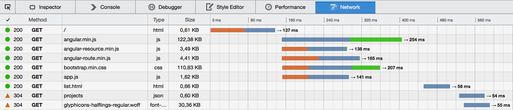
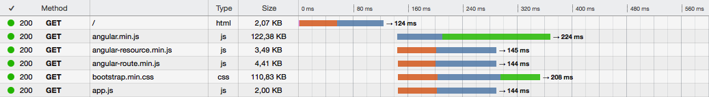

# Serve-SPA

[Express](http://expressjs.com) middleware to serve Single Page Applications with pushState urls and increased performance

[](https://gitter.im/analog-nico/serve-spa?utm_source=badge&utm_medium=badge&utm_campaign=pr-badge&utm_content=badge)

Linux: [](https://travis-ci.org/analog-nico/serve-spa) [](https://coveralls.io/r/analog-nico/serve-spa?branch=master) Windows: [](https://ci.appveyor.com/project/analog-nico/serve-spa/branch/master) General: [](https://david-dm.org/analog-nico/serve-spa)

## Why?

### pushState Url Support

Serve-SPA behaves like the [express.static middleware](http://expressjs.com/guide/using-middleware.html#express.static). However, if a pushState url is requested Serve-SPA does not return a 404 but instead serves the matching SPA page.

Assume you have this very simple SPA served from this folder:

```
spa
 |-- index.html
 |-- app.js
```

At first a visitor usually loads your SPA via the base url `http://localhost:3000/`. Thus index.html is served and also app.js is loaded. Next the visitor navigates through your SPA which updates the url using pushState and e.g. arrives at `http://localhost:3000/profile/me`. The visitor might now bookmark this page and open it again the next day. express.static would send a 404 for this url because the served folder does not contain a "profile" folder containing a "me" file. Serve-SPA, however, recognizes `http://localhost:3000/profile/me` as a pushState url and searches the folder structure for a page that matches the given url *best*, i.e. `http://localhost:3000/`.

All you need to do to activate pushState url support is to rename your `index.html` files to `index.htmlt` (with a *t*). I.e.:

```
spa
 |-- index.htmlt <-- Just renamed and pushState urls are supported
 |-- app.js
```

### Initial Page Load Performance

This is how a regular SPA (using Angular.js in this case) gets loaded:



The time until the user sees the page is significantly increased by the two AJAX requests "list.html" which is a HTML template and "projects" which is the JSON data used to populate the page.

With Serve-SPA you can easily inline the template / data into the `index.htmlt` so that the AJAX calls are skipped and the page gets rendered immediately:



Serve-SPA brings the power of [lodash's templating](https://lodash.com/docs#template) to your `index.htmlt` files. The above example for the regular SPA uses this html page:

``` html
<!doctype html>
<html ng-app="project">
    <head>
        <title>Pure Angular.js SPA</title>
        <script src="/bower_components/angular/angular.min.js"></script>
        <script src="/bower_components/angular-resource/angular-resource.min.js"></script>
        <script src="/bower_components/angular-route/angular-route.min.js"></script>
        <link rel="stylesheet" href="/bower_components/bootstrap/dist/css/bootstrap.min.css">
        <script src="/scripts/app.js"></script>
        <base href="/">
    </head>
    <body>
        <div class="container">
            <h1>JavaScript Projects</h1>
            <div ng-view></div>
        </div>
    </body>
</html>
```

If the visitor requests `http://localhost:3000/` this SPA need the `list.html` template to render. To skip the otherwise necessary AJAX call the template should be inlined. However, since other pushState urls don't need this template it should only be inlined if `http://localhost:3000/` is requested. This can be accomplished with the following addition to `index.htmlt`:

``` diff
    <body>
+       <% if (req.path === '/') { %>
+           <script type="text/ng-template" id="partials/list.html">
+               <%= require('fs').readFileSync('app/partials/list.html') %>
+           </script>
+       <% } %>
        <div class="container">
            <h1>JavaScript Projects</h1>
            <div ng-view></div>
        </div>
    </body>
```

There are ways (e.g. using `compose.js`) to implement this in a cleaner and non-blocking way but you get the idea.

## Getting Started

If you already serve your SPA with the [express.static middleware](http://expressjs.com/guide/using-middleware.html#express.static) you will be able to serve it with Serve-SPA instead:

``` js
// Just replace:
app.use(express.static(appDir));

// with:
serveSpa(app, appDir);
```

Then you rename your `index.html` files to `index.htmlt`.

``` diff
app
 |-- blog
 |    |-- img
 |    |    |-- ...
 |    |
-|    |-- index.html
+|    |-- index.htmlt
 |    |-- blog.css
 |    |-- blog.js
 |
-|-- index.html
+|-- index.htmlt
 |-- main.css
 |-- main.js
```

This gives you pushState url support and templating functionality to inline HTML templates and JSON data into the HTML served for each request. If you need to e.g. fetch the data from your database beforehand you can add a `compose.js` file alongside to do so:

``` diff
app
 |-- blog
 |    |-- img
 |    |    |-- ...
 |    |
+|    |-- compose.js  // May load latest article headlines from the database
 |    |-- index.htmlt // May inline article headline so the browser spares an AJAX call
 |    |-- blog.css
 |    |-- blog.js
 |
 |-- index.htmlt
 |-- main.css
 |-- main.js
```

BTW, Serve-SPA does not make any assumptions about how your SPA is implemented client-side. Any implementation should be able to work with the changes that need to be made server-side.

### Migrating Your SPA

Checkout the [Serve-SPA Demos repo](https://github.com/analog-nico/serve-spa-demos) which aims to provide regular and migrated versions of SPA for well-known SPA frameworks. To e.g. see how to migrate a Angular.js based SPA make a diff between [its regular implementation](https://github.com/analog-nico/serve-spa-demos/tree/master/demos/angularjs/original) and [the precomposed version](https://github.com/analog-nico/serve-spa-demos/tree/master/demos/angularjs/precomposed) which takes full advantage of Serve-SPA.

## Installation

[](https://npmjs.org/package/serve-spa)

The module for node.js is installed via npm:

``` bash
npm install serve-spa --save
```

Serve-SPA depends on a loosely defined version of serve-static. If you want to install a specific version please install serve-static beforehand.

## Usage

### Initialization

``` js
var serveSpa = require('serve-spa');

serveSpa(appOrRouter, rootPath, options);
```

* Required: `appOrRouter` should either be taken from `var app = express();` or `var router = express.Router();` depending on where you want to mount Serve-SPA. Using a router allows you to mount the SPA on a specific url. E.g. the SPA is mounted on `http://localhost:3000/app/` if you use `app.use('/app', router);`.
* Required: `rootPath` is the file system path to the SPA resources. The parameter is identical to the one used with `app.use(express.static(rootPath))`.
* Optional: `options` is an object that allows the following attributes:
    * `options.staticSettings` is forwarded to the serve-static middleware that is used internally. BTW, these are the same options that are passed to `express.static(rootPath, staticSettings)`. See the [documentation of serve-static's options](https://github.com/expressjs/serve-static#options) for details.
    * `options.beforeAll` takes a middleware that is executed before a template is rendered. Use it to do general things that are required for all templates. If you need to to things for a particular template use a compose.js file instead.
    * `options.templateSettings` is forwarded to lodash's `_.template(template, templateSettings)`. See the [documentation of `_.templateSettings`](https://lodash.com/docs#templateSettings) for details.
    * `options.require` takes a particular require function for being used within the template rendering. If the option is not given Serve-SPA provides its own require function when rendering a template. This require function might have a different module path lookup hierarchy. Thus the option allows to pass another require function that has a preferred module path lookup hierarchy.

### The HTML Template(s) "index.htmlt"

The template is a html file which may contain JavaScript mix-ins:

``` html
<!doctype html>
<html>
    <head>
        <title>Example template</title>
    </head>
    <body>
        Today is: <%= (new Date()).toString() %><br/>
		<ul>
            <% _.forEach(['Sunday', 'Monday', 'Tuesday', 'Wednesday', 'Thursday', 'Friday', 'Saturday'], function (day, i) { %>
                <li<%= (new Date()).getDay() === i ? ' style="color: red;"' : '' %>>
                    <%= day %>
                </li>
            <% }); %>
		</ul>
    </body>
</html>
```

This produces:

``` html
Today is: Tue Oct 20 2015 16:09:40 GMT+0200 (CEST)<br/>
<ul>
    <li>Sunday</li>
    <li>Monday</li>
    <li style="color: red;">Tuesday</li>
    <li>Wednesday</li>
    <li>Thursday</li>
    <li>Friday</li>
    <li>Saturday</li>
</ul>
```

Within the template the following variables are available:

* `_`: The lodash library
* `require`: Node's require function
* `request` and `req`: The request object provided by Express
* `response` and `res`: The response object provided by Express

#### Error Handling

If the rendering fails an Error is forwarded to the next error handling middleware. You may register your own error handling middleware like this:

``` js
// First Serve-SPA
serveSpa(app, rootPath);

// Then this middleware with the additional err parameter
app.use(function (err, req, res, next) {

    // If headers were already sent it gets complicated...
    if (res.headersSent) {
        return next(err); // ...just leave it to Express' default error handling middleware.
    }

    // Do your error handling:
	console.error(err);
    res.redirect('/guru-meditation/');

});
```

### The Composing Script(s) "compose.js"

Put a `compose.js` file into the same folder as your `index.htmlt` and it will be executes right before the template is rendered. This allow to e.g. fetch data from the database to use it when rendering the template.

`compose.js` must export a middleware:

``` js
var db = require('../lib/db.js');

module.exports = function (req, res, next) {

    db.loadData({ for: 'me' }, function (err, data) {

       if (err) {
           return next(err);
	   }

       req.data = data; // You can access the data through req.data in the template now.
	   next();

	});

};
```

#### Error Handling

The middleware exported through `compose.js` is used like a regular middleware. Thus the error handling works as usual.

### The "beforeAll" Hook

A middleware can be passed through `options.beforeAll` that is executed for all requests that result in rendering a template. If only a static file is requested this middleware is not executed.

The overall execution order is the following:

1. beforeAll middleware
2. compose.js middleware
3. Rendering index.htmlt

#### Error Handling

The provided middleware is used like a regular middleware. Thus the error handling works as usual.

### Responding to HEAD Requests

Like `express.static(...)` Serve-SPA only processes GET and HEAD requests. By default for a HEAD request neither the beforeAll and compose.js middlewares are executed nor the index.htmlt template is rendered. However, executing the middlewares can be explicitly activated by adding `callForHEAD = true` to the middleware function:

``` js
function middlewareForGETandHEAD(req, res, next) {

    res.set('my-header', 'yay');

    if (req.method === 'GET') {
        db.load(...);
    }
}

middlewareForGETandHEAD.callForHEAD = true;
```

## Contributing

To set up your development environment for Serve-SPA:

1. Clone this repo to your desktop,
2. in the shell `cd` to the main folder,
3. hit `npm install`,
4. hit `npm install gulp -g` if you haven't installed gulp globally yet, and
5. run `gulp dev`. (Or run `node ./node_modules/.bin/gulp dev` if you don't want to install gulp globally.)

`gulp dev` watches all source files and if you save some changes it will lint the code and execute all tests. The test coverage report can be viewed from `./coverage/lcov-report/index.html`.

If you want to debug a test you should use `gulp test-without-coverage` to run all tests without obscuring the code by the test coverage instrumentation.

## Change History

- v1.0.1 (2016-04-03)
    - Improved cache busting
    - Added node.js v5 to CI build
    - Updated dependencies
- v1.0.0 (2015-10-20)
    - **Breaking Change**: Added explicit HEAD request handling
    - Fixed beforeAll hook to only get called when a template is served
    - Better cache suppression by removing the ETag header
    - Updated dependencies
- v0.3.0 (2015-09-18)
    - Added beforeAll hook
    - Updated dependencies
- v0.2.3 (2015-05-20)
    - Fixed matching templates to pushState URLs
    - Updated dependencies
- v0.2.2 (2015-04-12)
    - index.htmlt files are validated during startup
    - Updated dependencies
- v0.2.1 (2015-02-10)
    - Fix for using `express.Router()` in compose.js
    - Increased serve-static dependency to ^1.7.2 to fix a [vulnerability](https://nodesecurity.io/advisories/serve-static-open-redirect)
    - Added Node.js 0.12 and io.js to the Linux build
- v0.2.0 (2015-01-09)
    - **Breaking Change:** Renamed preproc.js to compose.js
- v0.1.1 (2014-12-22)
    - Allowing preproc.js to export an `express.Router()`
- v0.1.0 (2014-12-06)
    - Initial version

## License (ISC)

In case you never heard about the [ISC license](http://en.wikipedia.org/wiki/ISC_license) it is functionally equivalent to the MIT license.

See the [LICENSE file](LICENSE) for details.
