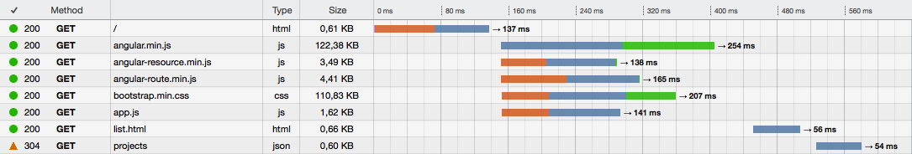

# Serve-SPA

[Express](http://expressjs.com) middleware to serve Single Page Applications with pushState urls and increased performance

[](https://gitter.im/analog-nico/serve-spa?utm_source=badge&utm_medium=badge&utm_campaign=pr-badge&utm_content=badge)

Linux: [](https://travis-ci.org/analog-nico/serve-spa) [](https://coveralls.io/r/analog-nico/serve-spa?branch=master) Windows: [](https://ci.appveyor.com/project/analog-nico/serve-spa/branch/master) General: [](https://david-dm.org/analog-nico/serve-spa)

## Why?

### pushState Url Support

Serve-SPA behaves like the [express.static middleware](http://expressjs.com/guide/using-middleware.html#express.static). However, if a pushState url is requested Serve-SPA does not return a 404 but instead serves the matching SPA page.

Assume you have this very simple SPA served from this folder:

```
spa
 |-- index.html
 |-- app.js
```

At first a visitor usually loads you SPA via the base url `http://localhost:3000/`. Thus index.html is served and also app.js is loaded. Next the visitor navigates through your SPA which updates the url using pushState and e.g. arrives at `http://localhost:3000/profile/me`. The visitor might now bookmark this page and open it again the next day. express.static would send a 404 for this url because the served folder does not contain a "profile" folder containing a "me" file. Serve-SPA, however, recognizes `http://localhost:3000/profile/me` as a pushState url and searches the folder structure for a page that matches *most* of the given url, i.e. `http://localhost:3000/`.

All you need to do to activate pushState url support is to rename your `index.html` files to `index.htmlt` (with a t). I.e.:

```
spa
 |-- index.htmlt <-- Just renamed an pushState urls are supported
 |-- app.js
```

### Initial Page Load Performance

This is how a regular SPA (using Angular.js in this case) gets loaded:



The time until the user sees the page is significantly increased by the two AJAX requests "list.html" which is a HTML template and "projects" which is the JSON data used to populate the page.

With Serve-SPA you can easily inline the template / data into the `index.htmlt` so that the AJAX calls are skipped and the page gets rendered immediately:


Serve-SPA brings the power of [lodash's templating](https://lodash.com/docs#template) to your `index.htmlt` files. The above example for the regular SPA uses this html page:

``` html
<!doctype html>
<html ng-app="project">
    <head>
        <title>Pure Angular.js SPA</title>
        <script src="/bower_components/angular/angular.min.js"></script>
        <script src="/bower_components/angular-resource/angular-resource.min.js"></script>
        <script src="/bower_components/angular-route/angular-route.min.js"></script>
        <link rel="stylesheet" href="/bower_components/bootstrap/dist/css/bootstrap.min.css">
        <script src="/scripts/app.js"></script>
        <base href="/">
    </head>
    <body>
        <div class="container">
            <h1>JavaScript Projects</h1>
            <div ng-view></div>
        </div>
    </body>
</html>
```

If the visitor requests `http://localhost:3000/` this SPA need the `list.html` template to render. To reduce an AJAX call the template should be inlined. However, since other pushState urls don't need this template it should only be inlined if `http://localhost:3000/` is requested. This can be accomplished with the following addition to `index.htmlt`:

``` html
    <body>
+        <% if (req.path === '/') { %>
+            <script type="text/ng-template" id="partials/list.html">
+                <%= require('fs').readFileSync('app/partials/list.html') %>
+            </script>
+        <% } %>
        <div class="container">
            <h1>JavaScript Projects</h1>
            <div ng-view></div>
        </div>
    </body>
```

There are ways (e.g. using `compose.js`) to implement this in a cleaner way but you get the idea.

## Getting Started

### Roughly speaking...

If you already serve your SPA with the [express.static middleware](http://expressjs.com/guide/using-middleware.html#express.static) you will be able to serve it with Serve-SPA instead:

``` js
// Just replace:
app.use(express.static(appDir));

// with:
serveSpa(app, appDir);
```

Then you rename your `index.html` files to `index.htmlt` which gives you pushState url support and templating functionality to inline HTML templates and JSON data into the HTML served for each request. If you need to e.g. fetch the data from your database beforehand you can add a `compose.js` file alongside to do so.

BTW, Serve-SPA does not make any assumptions about how your SPA is implemented client-side. Any implementation should be able to work with the changes that need to be made server-side.

### Migrating a Simple SPA

Screencast forthcoming. It will explain how and why I turned a [regular Angular.js-based SPA](https://github.com/analog-nico/serve-spa-demos/tree/master/demos/angularjs/original) into a [precomposed SPA served with Serve-SPA](https://github.com/analog-nico/serve-spa-demos/tree/master/demos/angularjs/precomposed). Make a diff and you will see the required changes.

## Installation

[](https://npmjs.org/package/serve-spa)

The module for node.js is installed via npm:

``` bash
npm install serve-spa --save
```

Serve-SPA depends on a loosely defined version of serve-static. If you want to install a specific version please install serve-static beforehand.

## Usage

### Initialization

Description forthcoming.

### The HTML Template(s) "index.htmlt"

Description forthcoming.

#### Error Handling

Description forthcoming.

### The Composing Script(s) "compose.js"

Description forthcoming.

#### Error Handling

Description forthcoming.

### Serving Static Files and pushState Support

Description forthcoming.

## Contributing

To set up your development environment for Serve-SPA:

1. Clone this repo to your desktop,
2. in the shell `cd` to the main folder,
3. hit `npm install`,
4. hit `npm install gulp -g` if you haven't installed gulp globally yet, and
5. run `gulp dev`. (Or run `node ./node_modules/.bin/gulp dev` if you don't want to install gulp globally.)

`gulp dev` watches all source files and if you save some changes it will lint the code and execute all tests. The test coverage report can be viewed from `./coverage/lcov-report/index.html`.

If you want to debug a test you should use `gulp test-without-coverage` to run all tests without obscuring the code by the test coverage instrumentation.

## Change History

- v0.3.0 (2015-09-18)
    - Added beforeAll hook
    - Updated dependencies
- v0.2.3 (2015-05-20)
    - Fixed matching templates to pushState URLs
    - Updated dependencies
- v0.2.2 (2015-04-12)
    - index.htmlt files are validated during startup
    - Updated dependencies
- v0.2.1 (2015-02-10)
    - Fix for using `express.Router()` in compose.js
    - Increased serve-static dependency to ^1.7.2 to fix a [vulnerability](https://nodesecurity.io/advisories/serve-static-open-redirect)
    - Added Node.js 0.12 and io.js to the Linux build
- v0.2.0 (2015-01-09)
    - **Breaking Change:** Renamed preproc.js to compose.js
- v0.1.1 (2014-12-22)
    - Allowing preproc.js to export an `express.Router()`
- v0.1.0 (2014-12-06)
    - Initial version

## License (ISC)

In case you never heard about the [ISC license](http://en.wikipedia.org/wiki/ISC_license) it is functionally equivalent to the MIT license.

See the [LICENSE file](LICENSE) for details.
